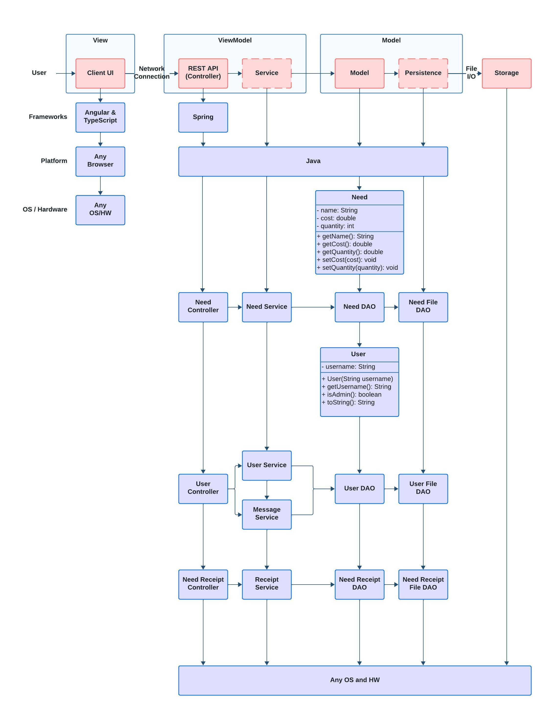

# PROJECT Design Documentation

> _The following template provides the headings for your Design
> Documentation.  As you edit each section make sure you remove these
> commentary 'blockquotes'; the lines that start with a > character
> and appear in the generated PDF in italics._

## Team Information
* Team name: Toasters
* Team members
  * Ethan Hartman
  * Albert Abaykhanov
  * Ben Griffin
  * Bevan Neiberg

## Executive Summary

A local organization that facilitates the funding of student projects. Volunteers can either provide monetary support or direct goods and services for projects of their choice.

### Purpose
Project Statement:
A web application which allows users to fund student projects in order to complete the projects.
The most important user group is the Student, which adds needs to their project. Their goal is to fulfill their project needs and finish the project.

### Glossary and Acronyms
> _**[Sprint 2 & 4]** Provide a table of terms and acronyms._

| Term | Definition |
|------|------------|
| SPA | Single Page |
| MVP | Minimum Viable Product|

## Requirements

This section describes the features of the application.

> _In this section you do not need to be exhaustive and list every
> story.  Focus on top-level features from the Vision document and
> maybe Epics and critical Stories._

### Definition of MVP
The MVP allows for users to sign into the application, view student projects, add needs from those projects to their fund basket, and view the fund basket, as well as checking out their basket to fund the student projects.
For students, it allows the creation and managing of needs for project funding.

### MVP Features
>  _**[Sprint 4]** Provide a list of top-level Epics and/or Stories of the MVP._

### Enhancements
> _**[Sprint 4]** Describe what enhancements you have implemented for the project._

## Application Domain

This section describes the application domain.

> _**[Sprint 2 & 4]** Provide a high-level overview of the domain for this application. You
> can discuss the more important domain entities and their relationship
> to each other._
Students can create and manage needs. Students can log in as admins.
Supporters can view needs in student projects and they can also add and remove needs from their funding basket.
Supporters can check out their fund basket.

## Architecture and Design

This section describes the application architecture.

### Summary

The following Tiers/Layers model shows a high-level view of the webapp's architecture. 
**NOTE**: detailed diagrams are required in later sections of this document. (_When requested, replace this diagram with your **own** rendition and representations of sample classes of your system_.) 

The web application, is built using the Model–View–ViewModel (MVVM) architecture pattern. 

The Model stores the application data objects including any functionality to provide persistance. 

The View is the client-side SPA built with Angular utilizing HTML, CSS and TypeScript. The ViewModel provides RESTful APIs to the client (View) as well as any logic required to manipulate the data objects from the Model.

Both the ViewModel and Model are built using Java and Spring Framework. Details of the components within these tiers are supplied below.

### Overview of User Interface

The user flow begins at the home page, where users can either log in or explore the projects. Logged-in admin users, have access to a wide range of functionalities like project creation, management, and detailed views. Regular users can browse projects, support them, and engage through the messaging system. The checkout and basket pages facilitate the funding process, while the leaderboard adds a competitive or community-focused element. The application is designed to guide users smoothly from discovering projects to supporting them, with clear navigation and user-friendly interfaces.

### View Tier
The application is a system designed for creating and managing Needs. It offers a platform for students to seek support and for kind supporters to contribute, bringing projects to life.
Navigating the Application:

Upon launching the application, users are greeted with a login page. This is the gateway to the application's ecosystem, where users can access their roles either as students seeking support or as supporters willing to fund needs. 

The Admin Experience:

Logging in as an admin, users find themselves in the "Project Need Cupboard", a central repository where all student needs are listed. Here, an admin can edit existing needs by simply clicking on them. Once valid inputs are entered, the admin can successfully update the need, with the total cost dynamically reflected in the cupboard.

Creating and Managing Needs:

Transitioning to the perspective of a regular user, the application allows for the creation of new needs. A user can add any need they require as long as it doesn't contain conflicting names or other invalid input. In the funded needs section, the application showcases a comprehensive view of all needs that have been funded, including details about the supporters. Users can interact with this section to send messages to supporters.
 
The Supporter Experience:

From a supporter's perspective, the application provides a seamless experience in browsing and funding needs. A supporter logs in and navigates the list of needs, updating their basket with chosen items. The application dynamically updates the needs list and the stock availability as supporters fund items, ensuring real-time accuracy in the display of information. A search functionality is also available, allowing supporters to filter needs based on specific criteria.

Checkout and Leaderboard:

Supporters can proceed to checkout with their selected items in the funding basket. Post-checkout, the application updates the leaderboard, reflecting the contributions made by each supporter. The leaderboard is an engaging feature that ranks supporters based on their funding amounts, fostering a sense of community and competition.

Messages and Interaction:

Another key feature is the messaging system. Supporters receive messages for their contributions, which they can view and manage in their inboxes. This feature adds a layer of personal interaction between students and supporters, enhancing the sense of community within the application.

Conclusion and User Cycle:

As users log out and new users sign in, the application demonstrates its capacity to handle multiple user sessions and maintain the integrity of each user's actions. For example, when new user logs in, they see a fresh perspective of the application, with their funding basket and potential contributions reflected distinctly from previous users.

> _**[Sprint 4]** You must  provide at least **2 sequence diagrams** as is relevant to a particular aspects 
> of the design that you are describing.  (**For example**, in a shopping experience application you might create a 
> sequence diagram of a customer searching for an item and adding to their cart.)
> As these can span multiple tiers, be sure to include an relevant HTTP requests from the client-side to the server-side 
> to help illustrate the end-to-end flow._

> _**[Sprint 4]** To adequately show your system, you will need to present the **class diagrams** where relevant in your design. Some additional tips:_
 >* _Class diagrams only apply to the **ViewModel** and **Model** Tier_
>* _A single class diagram of the entire system will not be effective. You may start with one, but will be need to break it down into smaller sections to account for requirements of each of the Tier static models below._
 >* _Correct labeling of relationships with proper notation for the relationship type, multiplicities, and navigation information will be important._
 >* _Include other details such as attributes and method signatures that you think are needed to support the level of detail in your discussion._

### ViewModel Tier
> _**[Sprint 4]** Provide a summary of this tier of your architecture. This
> section will follow the same instructions that are given for the View
> Tier above._

> _At appropriate places as part of this narrative provide **one** or more updated and **properly labeled**
> static models (UML class diagrams) with some details such as critical attributes and methods._
> 

### Model Tier
> _**[Sprint 3 & 4]** Provide a summary of this tier of your architecture. This
> section will follow the same instructions that are given for the View
> Tier above._
For the model portion, we can see we have Need objects, which have the following private properties, name, cost, quantity. They have getters for those 3 properties, and setters for cost and quantity. Needs are used heavily within the Need File DAO, which is an extension of the Need DAO. Users have the private username property, and a getter for getting that username, and a method, isAdmin to check if the user is an admin. Users are used within the User File DAO, which is an extension of the User DAO.

> _At appropriate places as part of this narrative provide **one** or more updated and **properly labeled**
> static models (UML class diagrams) with some details such as critical attributes and methods._
> 

## OO Design Principles
Principle 1: Single Responsibility
We can see single responsibility, as we have our controllers, persistence, and model classes all separated. Moving even deeper, we have a User class, which holds usernames for users, and a Supporter class specifically for supporters, which inherits from the user class and includes a funding basket. We separated the two because an admin is a user but is not a supporter. 

Principle 2: Law of Demeter
We see the law of Demeter when analyzing the controllers. The two controllers, UserController and NeedController only have access to their specific DAO class, UserDAO or NeedDAO. These controllers are then accessed by their specific Angular service, user service and need service.

Principle 3: High Cohesion
All of our classes are named according to their functionality, similarly, they use other classes which have related functionality.
For example, if we look at the NeedFileDAO, we can see that this handles all persistence of Need objects

Principle 4: Open/Closed
The Open/Closed Principle is used in our project such that classes are open for extension but closed for modification. A specific example of this was our use of extending error classes, instead of having to rewrite our files. We wrote our code so that when we need more error handling, we don't need to break other code to add more handling. 

## Static Code Analysis/Future Design Improvements
> _**[Sprint 4]** With the results from the Static Code Analysis exercise, 
> **Identify 3-4** areas within your code that have been flagged by the Static Code 
> Analysis Tool (SonarQube) and provide your analysis and recommendations.  
> Include any relevant screenshot(s) with each area._

> _**[Sprint 4]** Discuss **future** refactoring and other design improvements your team would explore if the team had additional time._

## Testing
> _This section will provide information about the testing performed
> and the results of the testing._

### Acceptance Testing
> _**[Sprint 4]** Report on the number of user stories that have passed all their
> acceptance criteria tests, the number that have some acceptance
> criteria tests failing, and the number of user stories that
> have not had any testing yet. Highlight the issues found during
> acceptance testing and if there are any concerns._
Sprint 2: 9/9 user stories passed all acceptance criteria tests. No issues found during acceptance testing.

Sprint 3: 30/34 acceptance criteria passing tests, 2 of which were old acceptance criteria which should have been updated, but they weren't, resulting in failed tests. For the last 2, the testing team couldn't figure out how to use the search bar. However, if used correctly, the acceptance criteria do pass.

### Unit Testing and Code Coverage
> _**[Sprint 4]** Discuss your unit testing strategy. Report on the code coverage
> achieved from unit testing of the code base. Discuss the team's
> coverage targets, why you selected those values, and how well your
> code coverage met your targets._
Sprint 2: 9/9 user stories passed all acceptance criteria tests. No issues found during acceptance testing.

Sprint 3: 100% code coverage, no missing instructions and no missing branches.

>_**[Sprint 2 & 4]** **Include images of your code coverage report.** If there are any anomalies, discuss
> those._
